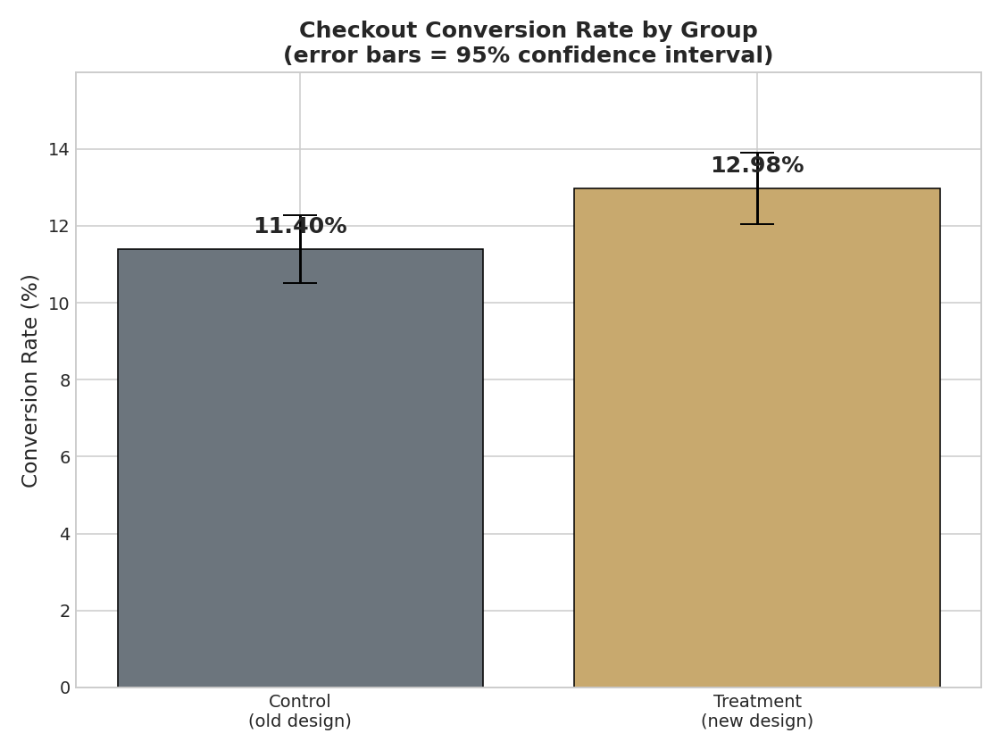
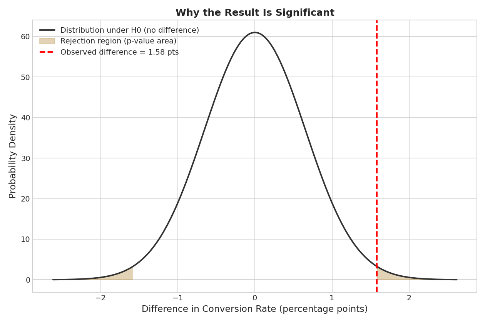
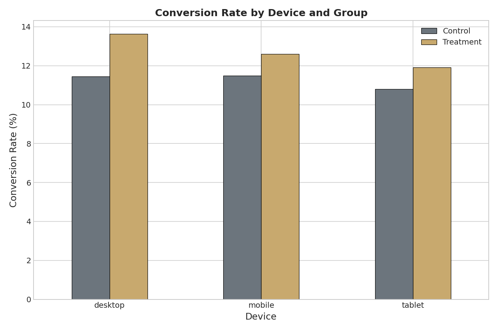

# A/B Test Analysis — Checkout Page Redesign

I built this project to answer a question every e-commerce company cares about: **does a redesigned checkout page actually make more people buy, or does it just look different?**

The trap with website changes is that someone redesigns a page, conversions tick up a little, and everyone assumes the new design caused it. But conversion rates move around on their own. The only way to know if a change really worked is to run a controlled experiment and test whether the difference is bigger than random noise. That's what A/B testing is for.

## The Experiment

- **Control group** (5,000 users) saw the old checkout page
- **Treatment group** (5,000 users) saw the new checkout page

The metric I measured was **conversion** — did the user complete a purchase. Users were randomly assigned, which makes the comparison fair.

## What I Did

1. **Set up the hypotheses.** Null: both designs convert the same. Alternative: the new design converts differently. Significance level 0.05.
2. **Calculated conversion rates.** Control 11.40%, treatment 12.98%.
3. **Ran a two-proportion z-test.** z = 2.41, p-value = 0.016.
4. **Cross-checked with a chi-square test.** p = 0.017 — same conclusion.
5. **Measured effect size.** 1.58 percentage point increase, 13.9% relative lift. 95% CI [0.30, 2.86] — doesn't cross zero.
6. **Ran sanity checks.** Confirmed groups were balanced in size and device mix.
7. **Segmented by device.** Lift held across desktop, mobile, and tablet.

## What I Found

The new checkout design produced a **statistically significant 13.9% lift in conversion** (p = 0.016). Since p < 0.05, I rejected the null hypothesis. Across 5,000 users the new design generated 79 extra conversions. **Recommendation: roll out the new design.**

## What I Learned

The biggest thing I took away is that the p-value isn't the whole story. A result can be statistically significant but tiny, or large but not significant if the sample is small. You have to look at the effect size and confidence interval alongside the p-value before making a call. I also learned why sanity checks matter — if the groups aren't balanced to begin with, the test result is meaningless.

## Tools

- **Python** — Pandas, NumPy, SciPy (statistical tests), Matplotlib
- **SQL** — conversion rates, segmentation, balance checks (8 queries)
- **Statistics** — two-proportion z-test, chi-square test, confidence intervals, hypothesis testing

## The Charts

